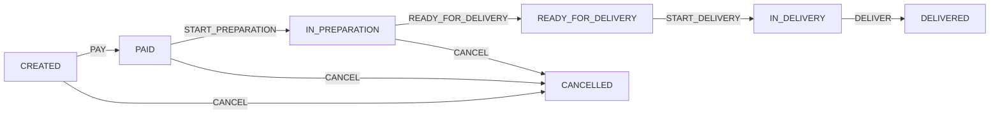

# Spring State Machine App

Spring Boot와 Spring State Machine을 활용한 주문 관리 시스템입니다. 주문의 상태 전이를 State Machine으로 관리하여 비즈니스 규칙을 명확히 하고 상태 변경을 자동화합니다.

## 🚀 주요 기능

### 핵심 상태 관리
- **자동 상태 전이**: Spring State Machine이 비즈니스 규칙에 따라 자동으로 상태를 변경
- **상태 동기화**: 기존 데이터베이스의 주문 상태와 State Machine을 자동 동기화
- **동시성 안전**: 요청별로 독립된 State Machine 인스턴스 사용
- **자동 영속화**: Interceptor를 통해 상태 변경 시 자동 데이터베이스 저장

### 주문 상태 플로우


### API 기능
- 고객(Customer) 관리 CRUD
- 주문(Order) 생성 및 상태 관리
- 결제(Payment) 처리
- 주문 아이템(OrderItem) 관리

## 🛠 기술 스택

- **언어**: Kotlin
- **프레임워크**: Spring Boot 3.5.4
- **데이터베이스**: Spring Data JPA + H2 Database
- **상태 관리**: Spring State Machine
- **빌드 도구**: Gradle Kotlin DSL
- **런타임**: Java 21+

## 📁 프로젝트 구조

```
src/main/kotlin/org/suyeong/springstatemachineapp/
├── entity/                 # JPA 엔티티
│   ├── Customer.kt
│   ├── Order.kt
│   ├── OrderItem.kt
│   └── Payment.kt
├── statemachine/           # Spring State Machine 설정
│   ├── OrderStates.kt      # 주문 상태 정의
│   ├── OrderEvents.kt      # 상태 전이 이벤트
│   ├── OrderStateMachineFactory.kt      # State Machine 팩토리
│   ├── OrderStateMachineService.kt      # 핵심 상태 관리 서비스
│   └── OrderStateChangeInterceptor.kt   # 자동 영속화 인터셉터
├── service/                # 비즈니스 서비스
├── controller/             # REST API 컨트롤러
├── repository/             # JPA 리포지토리
└── common/                 # 공통 유틸리티
    └── Result.kt           # Result 패턴 구현
```

## 🎯 State Machine 동작 원리

### 1. 상태 정의 (OrderStates)
```kotlin
enum class OrderStates {
    CREATED,            // 주문 생성
    PAID,              // 결제 완료
    IN_PREPARATION,    // 주문 준비중
    READY_FOR_DELIVERY, // 배송 준비 완료
    IN_DELIVERY,       // 배송중
    DELIVERED,         // 배송 완료
    CANCELLED          // 주문 취소
}
```

### 2. 이벤트 정의 (OrderEvents)
```kotlin
enum class OrderEvents {
    PAY,                    // 결제
    START_PREPARATION,      // 준비 시작
    READY_FOR_DELIVERY,     // 배송 준비 완료
    START_DELIVERY,         // 배송 시작
    DELIVER,               // 배송 완료
    CANCEL                 // 주문 취소
}
```

### 3. 핵심 동작 방식
1. **독립된 인스턴스**: 요청마다 새로운 State Machine 생성
2. **상태 동기화**: Event Replay를 통해 데이터베이스 상태로 동기화
3. **자동 전이**: 이벤트 발생 시 State Machine이 자동으로 상태 변경
4. **자동 저장**: Interceptor가 상태 변경을 데이터베이스에 자동 저장

## 🚦 빌드 및 실행

### 필수 요구사항
- JDK 21 이상
- Git

### 실행 방법
```bash
# 1. 프로젝트 클론
git clone <repository-url>
cd spring-state-machine-app

# 2. 빌드
./gradlew build

# 3. 테스트 실행
./gradlew test

# 4. 애플리케이션 실행
./gradlew bootRun
```

### 접속 정보
- **애플리케이션**: http://localhost:8080
- **H2 콘솔**: http://localhost:8080/h2-console
  - JDBC URL: `jdbc:h2:mem:testdb`
  - Username: `sa`
  - Password: (공백)

## 📋 API 사용 예시

### 주문 생성
```bash
curl -X POST http://localhost:8080/api/orders \
  -H "Content-Type: application/json" \
  -d '{
    "customerId": 1,
    "orderItems": [
      {
        "productName": "상품명",
        "quantity": 2,
        "unitPrice": 10000
      }
    ]
  }'
```

### 주문 결제 처리
```bash
curl -X POST http://localhost:8080/api/orders/1/pay
```

### 주문 상태 조회
```bash
curl -X GET http://localhost:8080/api/orders/1
```

## 🔧 핵심 설계 특징

### 1. 상태 관리
- **비즈니스 규칙 강제**: State Machine이 잘못된 상태 전이 차단
- **동시성 안전**: 요청별 독립된 State Machine 인스턴스
- **트랜잭션 안전**: @Transactional과 통합된 상태 관리

### 2. 아키텍처
- **Factory 패턴**: 독립된 State Machine 인스턴스 생성
- **Interceptor 패턴**: 상태 변경 시 자동 영속화
- **Result 패턴**: 풍부한 에러 정보 제공

### 3. 실용적 접근
- **Event Replay**: 기존 데이터와의 상태 동기화
- **Kotlin 스타일**: 안전한 null 처리와 간결한 코드
- **테스트 친화적**: 독립된 테스트 환경 구성

## 🧪 테스트

```bash
# 전체 테스트 실행
./gradlew test

# 특정 테스트 클래스 실행
./gradlew test --tests OrderStateMachineTest

# 테스트 결과 확인
./gradlew test --info
```

## 📝 주요 학습

1. **Spring State Machine 활용법**: Factory 패턴과 Interceptor를 통한 실용적 구현
2. **상태 동기화 전략**: Event Replay를 통한 기존 데이터와의 동기화
3. **동시성 처리**: 독립된 인스턴스를 통한 Thread-Safe 구현
4. **Kotlin + Spring**: 관용적 Kotlin 스타일과 Spring의 조화
